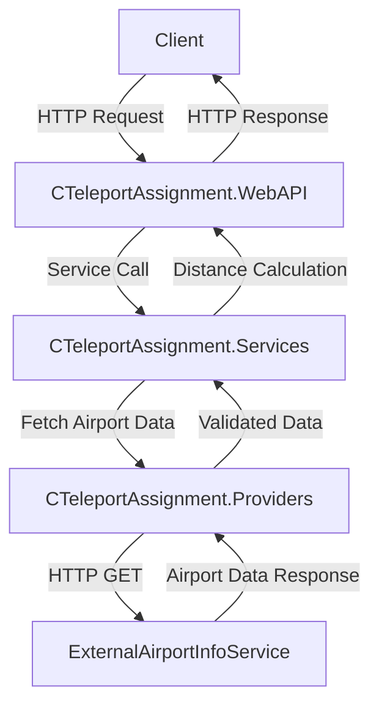

# CTeleport Assignment

## Description
This project demonstrates building scalable and resilient services using .NET Core 9.0. The service provides the capability to calculate the distance in miles between two airports, identified by their 3-letter IATA codes. Airport details are retrieved using an external HTTP API.

## Features
- Calculate distance between two airports using their IATA codes.
- RESTful API with structured layers for maintainability.
- Proper exception handling and logging for resiliency.
- Modular design following best practices like Domain-Driven Design (DDD).

### Low-Level Separation of Concerns
- Unit Testing
- Single Responsibility Principle
- Design by Contract
- Open/Closed Principle
- Dependency Inversion Principle
- High Cohesion and Loose Coupling
- Command–Query Separation
- Domain-driven Design (lite)

### Applied Design Patterns
- **Circuit Breaker Pattern**
- **Factory Method Pattern**
- **Strategy Pattern**
- **Template Method Pattern**
- **Result Pattern**
- **Mediator Pattern**
- **Decorator Pattern**
- **Builder Pattern**
- **Command Pattern**
- **Options Pattern**
- **Dependency Injection Pattern**

## Libraries and Frameworks
- **ASP.NET Core 9.0**: For building the REST API.
- **CSharpFunctionalExtensions**: For functional programming constructs.
- **NSubstitute**: For Unit tests.
- **Moq**: For Unit tests.
- **fluentassertions**: For better asserting in Unit tests.
 - **serilog**: For structured logging.
## Solution Structure

### 1. `CTeleportAssignment.Domain`
Encapsulates core domain models and business logic, including:
- **Models**: `Distance`, `Iata`, `Location`, `UnitType`
- **Domain Errors**: Encapsulates custom error types.

### 2. `CTeleportAssignment.Providers`
Handles communication with the external API to fetch airport details. Includes:
- **Provider Configuration**: URL and settings.
- **Exceptions**: Custom exceptions for validation and provider errors.
- **CTeleportProvider**: Implements `IAirportProvider` to retrieve airport details.

### 3. `CTeleportAssignment.Services`
Encapsulates the main business logic for calculating distances. Includes:
- **Services**: `CTeleportAirportService` for distance calculation.
- **Models**: `AirportPair`, encapsulating details of the calculated distance.

### 4. `CTeleportAssignment.WebAPI`
The API layer that exposes endpoints for external clients. Includes:
- **Controllers**: `AirportsController` to handle requests.
- **Endpoints**:
  - `GET /api/airports/distance/{firstIata}/{secondIata}`: Calculates the distance between two airports.

## Installation

1. Clone the repository:
   ```bash
   git clone https://github.com/TuralSuleymani/CTeleportAssignment.git
   cd CTeleportAssignment
   ```

2. Build the solution:
   ```bash
   dotnet build
   ```

3. Run the API:
   ```bash
   dotnet run --project CTeleportAssignment.WebAPI
   ```

## Usage
### API Endpoint
- **Calculate Distance Between Airports**
  ```http
  GET /api/airports/distance/{firstIata}/{secondIata}
  ```
  
  **Request Parameters:**
  - `firstIata`: IATA code of the first airport (e.g., AMS).
  - `secondIata`: IATA code of the second airport (e.g., JFK).

  **Responses:**
  - `200 OK`: Returns the distance in miles.
  - `404 Not Found`: If any of the airports are not found.
  - `400 Bad Request`: For invalid input.

## Example
### Request
```http
GET /api/airports/distance/AMS/JFK HTTP/1.1
Host: localhost:5000
```

### Response
```json
{
  "firstIata": "AMS",
  "secondIata": "JFK",
  "distance": 3635.44
}
```

## Communication Diagram


## Testing
Run unit tests:
```bash
dotnet test
```

## Improvements
- Add caching to reduce redundant API calls.
- Add unit tests for enhanced coverage.
- Dockerize the application for ease of deployment.
- Support for additional metrics (e.g., kilometers).

## License
This project is licensed under the MIT License.
